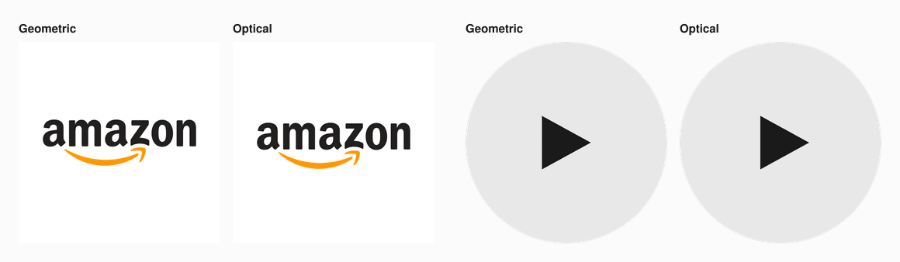

<a href="https://kairevicius.github.io/skills/optical-balance/">

</a>

# Skills

Skills for designers and engineers who want an agent to measure, not guess.

A design call like "the logo sits a bit high" usually ends in a nudge by eye. Nobody can repeat that nudge, and the next asset needs it again. These skills turn that kind of judgment into a measurement: the agent measures, puts the value where the rule lives, and checks the result it renders.

## Install

These are agent skills: plain `SKILL.md` folders that any agent which reads skills can use, such as Claude Code, Codex, Cursor, OpenCode, Gemini CLI, and [many more](https://github.com/vercel-labs/skills#supported-agents).

```bash
npx skills@latest add kairevicius/skills
```

The CLI asks which skills to install and for which agents. To choose up front, name them:

```bash
npx skills@latest add kairevicius/skills --skill optical-balance -a codex -a cursor
```

Add `-g` to install for your user instead of the current project. Without the CLI, copy a folder from `skills/` into your agent's skills folder.

A skill that ships a script lists its setup in its `SKILL.md`, and your agent follows it. `optical-balance` needs Node 18.17 or later. If its one dependency is missing, its script prints the exact `npm install` command for the folder your agent installed it in.

## Reference

- **[optical-balance](./skills/optical-balance/SKILL.md)** — Center and size logos and icons by what the eye sees, not by the bounding box. It measures the visual center and the perceived size, gives you the CSS offset, and checks the rendered result. [Site](https://kairevicius.github.io/skills/optical-balance/) · [Write-up](https://kairevicius.github.io/skills/optical-balance/write-up.html) · [Demo](https://kairevicius.github.io/skills/optical-balance/demo.html)

## How the skills are built

- **One job each.** A skill says what it does and what it leaves to other tools.
- **Measured, not asserted.** A number in a skill comes with the command that reproduces it.
- **Tested cold.** Before a skill ships, an agent that sees only the skill folder gets a realistic request. Every place it guesses becomes a fix in the skill.

## Develop

```bash
cd skills/optical-balance/scripts
npm ci && npm test                                  # the skill's regression tests
cd ../../.. && node sites/optical-balance/build-docs.mjs   # its site, in sites/optical-balance/dist
```

Each skill lives in `skills/<name>/`, which is the folder the installer copies. A skill's website, with its larger sources, lives in `sites/<name>/` and does not install. On every push to `main`, the GitHub Pages workflow runs the tests and publishes the sites. To turn it on, set the Pages source to "GitHub Actions" in the repository settings.

## License

MIT, see [LICENSE](LICENSE).

The brand logos in `sites/optical-balance/sources` are trademarks of their owners and appear only as test material. The icons in `skills/optical-balance/fixtures/icons` come from [Bootstrap Icons](https://icons.getbootstrap.com/) under the MIT license. The portrait is *Girl with a Pearl Earring* by Johannes Vermeer, in the public domain.
