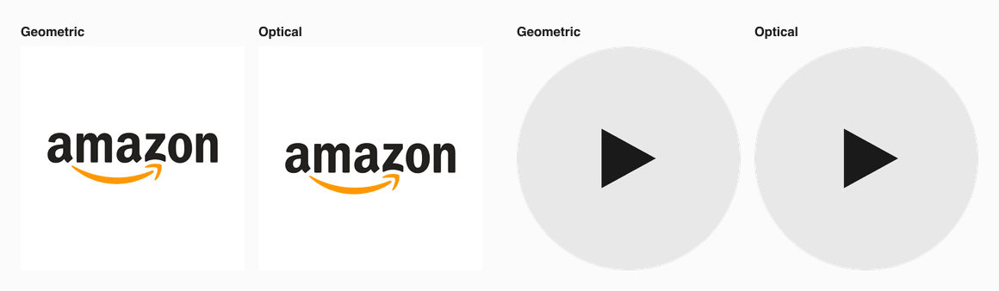

# Optical balance

A Claude Code skill that centers and sizes logos and icons by what the eye sees, not by the bounding box. It measures where an element looks centered and how large it looks, gives you the CSS offset, and checks the rendered result.



- **Center.** A play icon centered by its box looks pushed left, and a logo with a heavy base looks low. The skill finds the offset that puts the visual center on the container center.
- **Size.** At one height, a wide wordmark looks larger than a compact mark. The skill scales a set of logos to one perceived size.
- **Check.** The skill renders the result, measures it again, and reports PASS or FAIL against a fixed gate.

[Landing page](https://kairevicius.github.io/optical-balance/) · [Write-up](https://kairevicius.github.io/optical-balance/write-up.html) · [Demo of optical align tools](https://kairevicius.github.io/optical-balance/demo.html)

## Install

You need [Claude Code](https://claude.com/claude-code) and Node 18.17 or later.

```bash
git clone https://github.com/kairevicius/optical-balance.git ~/.claude/skills/optical-balance
cd ~/.claude/skills/optical-balance/scripts && npm install
```

To use the skill in one project only, clone it into that project's `.claude/skills/` folder instead.

## Use

Ask Claude Code in your own words. For example:

- "The play icon in our round button looks off center. Fix it."
- "Make these partner logos look the same size in a 32px row."
- "Bake these company logos into 96px avatar tiles."

Claude reads [`SKILL.md`](SKILL.md), measures your files, and gives you values to put into the component, the icon set, or the asset pipeline.

The command line also works on its own. Run it from any folder:

```bash
# Find the CSS offset for an icon in a button, and check it at 4x
node scripts/optical.mjs place play.svg --container 40 --element 20 --plate "#111111" --shape circle --out pair.png

# Size a row of logos, render it at 2x, and check the size spread
node scripts/optical.mjs strip logos/*.svg --out strip.png --height 32 --scale 2

# Check a cropped screenshot of a rendered container
node scripts/optical.mjs check button.png --bg "#111111"
```

The other commands are `measure`, `equalize`, `tile`, and `frame`. The top of [`scripts/optical.mjs`](scripts/optical.mjs) lists every option.

## How it works

The visual center is halfway between the center of the ink box and the mass centroid. Each pixel weighs by the square of its contrast with the background, so a faint accent, such as the Amazon smile, counts for less. When faint ink is more than a third of the mark, it is a second tone and keeps its full weight. Size uses the geometric mean of the contrast-weighted ink size and the ink height.

[`reference/method.md`](reference/method.md) has the formulas and the constants. [`reference/evidence.md`](reference/evidence.md) has worked examples, a calibration, and a validation on 74 logos and icons that the method was not tuned on.

## Limits

- The method measures luminance contrast, not hue. A saturated red looks heavier than a gray of the same luminance.
- A photo needs a plain backdrop. A busy scene needs a face or subject detector first.
- A small raster that must be enlarged blurs, so its numbers are less exact. Use an SVG or a larger PNG. The script warns when this happens.

## Develop

```bash
cd scripts
npm test             # regression tests for the method and the CLI
npm run docs         # build docs/: the landing page, the write-up, and the demo
npm run docs:inline  # the same pages with every figure embedded, one file each
```

The pages are build output, so git ignores them. The GitHub Pages workflow in `.github/workflows/pages.yml` runs the tests, builds the pages, and publishes them on every push to `main`. To turn it on, set the Pages source to "GitHub Actions" in the repository settings.

## License

MIT, see [`LICENSE`](LICENSE).

The brand logos in `docs/sources` are trademarks of their owners and appear only as test material. The icons in `docs/sources/icons` come from [Bootstrap Icons](https://icons.getbootstrap.com/) under the MIT license. The portrait is *Girl with a Pearl Earring* by Johannes Vermeer, in the public domain.
